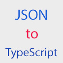

[](https://github.com/bang88/j2t.git)
# j2t

[Get Source Code from Github ](https://github.com/bang88/j2t.git)

> Convert json to TypeScript interface.

## Table of Contents

- [Install](#install)
- [Usage](#usage)
- [Contribute](#contribute)
- [License](#license)

## Install

```
ext install j2t
```

## Usage

Copy your JSON object into system clipboard, then go to vscode find `Convert JSON to Interface` command. That's it.

## Contribute

Small note: If editing the README, please conform to the [standard-readme](https://github.com/RichardLitt/standard-readme) specification.

## License

MIT © bang88
